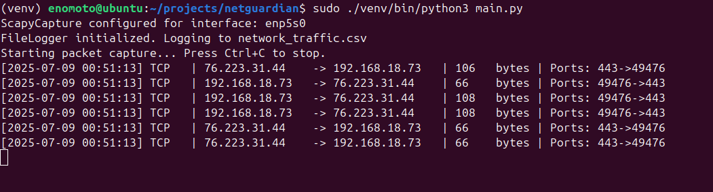
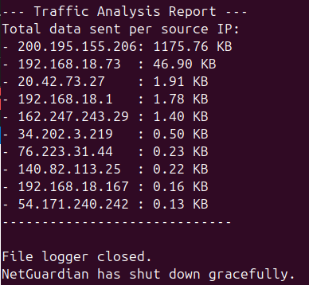
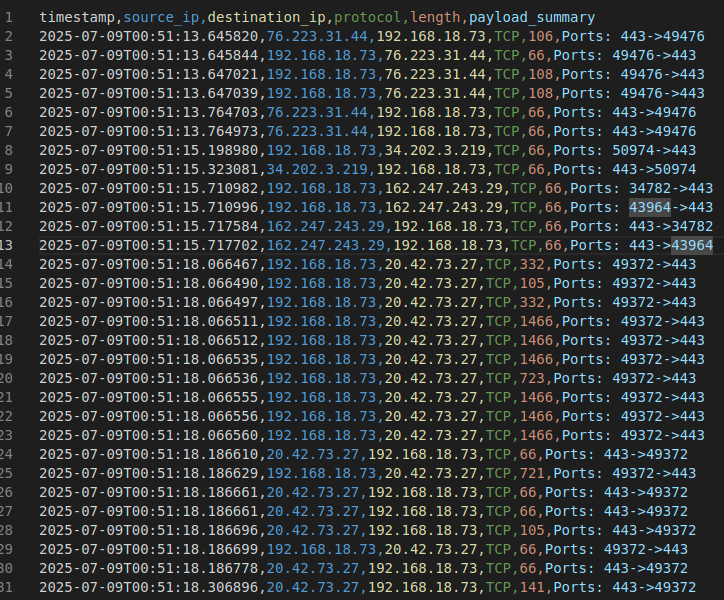

# NetGuardian - Advanced Network Monitor

NetGuardian is a sophisticated network traffic monitor written in Python, designed with Clean Architecture and modern software design patterns. It provides a clear, extensible, and testable foundation for network analysis.

## 🏛️ Architecture
This project strictly follows **Clean Architecture** principles:
- **Domain Layer**: The core business logic, completely independent of any framework.
- **Application Layer**: Orchestrates the domain to perform specific use cases.
- **Infrastructure Layer**: Contains all external details like I/O, database connections, and framework-specific code (e.g., `scapy`).

The key principle is the **Dependency Rule**: source code dependencies can only point inwards. The infrastructure depends on the application, and the application depends on the domain.

## ✨ Features
- **Live Packet Capture**: Monitors network traffic in real-time.
- **Configurable**: Easily set the network interface and logging options in `config.ini`.
- **Extensible Observer Pattern**:
  - `ConsolePresenter`: Prints live traffic to the console.
  - `FileLogger`: Logs all captured traffic to a CSV file.
  - `TrafficAnalyzer`: Provides a summary of data volume per source IP.
- **Dependency Inversion**: Abstractions (interfaces) are used to decouple the application core from infrastructure details.
- **Testable**: A `tests/` directory is included with `pytest` examples.
- **Graceful Shutdown**: Handles `Ctrl+C` to stop monitoring and provide a final report.

## ⚙️ Setup

1.  **Clone the repository:**
    ```bash
    git clone <your-repo-url>
    cd netguardian
    ```

2.  **Create a virtual environment (recommended):**
    ```bash
    python -m venv venv
    source venv/bin/activate  # On Windows, use `venv\Scripts\activate`
    ```

3.  **Install dependencies:**
    ```bash
    pip install -r requirements.txt
    ```

4.  **Configure the monitor:**
    Edit the `config.ini` file to set your network interface and logging preferences.

## ▶️ How to Run

You must run the script with root/administrator privileges to allow packet sniffing.

**Important Note for Linux users:** When using `sudo`, the system often ignores the active virtual environment and uses the system-wide Python interpreter, which might not have `scapy` installed. To ensure the script uses the Python interpreter from your virtual environment, specify its full path.

```bash
sudo ./venv/bin/python3 main.py
```

To run the tests:

```bash
pytest
```

## Images







